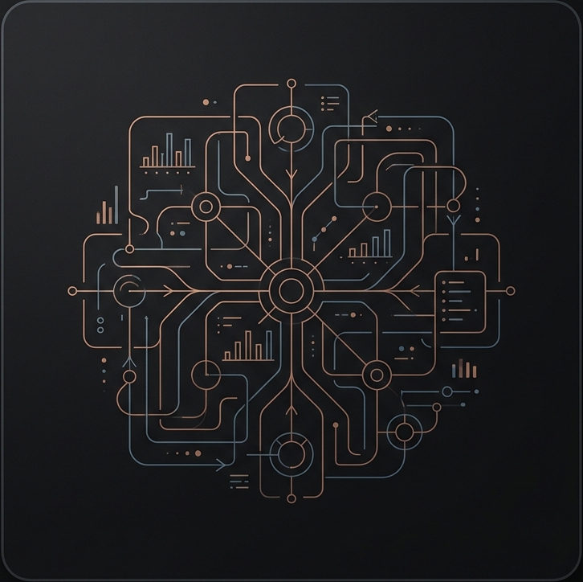

# Vardaan Bazaz

<p align="center">
  
</p>

<p align="center">
  <strong>Software Engineer • AI/ML • Systems Builder</strong>
  <br/>
  <small>Crafting predictable software, intelligent systems, and applied research from a quiet workspace.</small>
</p>

<p align="center">
  <code><a href="https://vardaanbazaz.com" style="text-decoration: none; color: #CF9E4F;">portfolio</a></code> &nbsp;•&nbsp;
  <code><a href="https://linkedin.com/in/vardaanbazaz" style="text-decoration: none; color: #CF9E4F;">linkedin</a></code> &nbsp;•&nbsp;
  <code><a href="mailto:vardaanbazaz@gmail.com" style="text-decoration: none; color: #CF9E4F;">email</a></code>
</p>

---

### ✦ The Workshop Philosophy
> "Engineering is a craft—part structural precision, part patient discovery. I build software the way an artisan constructs a room: deliberate, harmonious, and built to endure."

I bridge the boundary between academic research and production engineering, focusing on the architecture of machine learning pipelines, full-stack products, and spatial computer vision models.

---

### ✦ Core Focus Areas

<table width="100%" style="border-collapse: collapse; border: none;">
  <tr style="border: none;">
    <td width="50%" style="border: none; padding: 8px 10px; vertical-align: top;">
      
      <strong>AI / Machine Learning</strong>
      <br/><small style="color: #A89F84;">Deep learning architectures, dataset orchestration, and training pipelines.</small>
    </td>
    <td width="50%" style="border: none; padding: 8px 10px; vertical-align: top;">
      
      <strong>Computer Vision</strong>
      <br/><small style="color: #A89F84;">Spatial geometry mapping, camera sensor pipelines, and object tracking.</small>
    </td>
  </tr>
  <tr style="border: none;">
    <td width="50%" style="border: none; padding: 8px 10px; vertical-align: top;">
      
      <strong>Systems Design</strong>
      <br/><small style="color: #A89F84;">High-throughput backend architectures, relational schemas, and workflows.</small>
    </td>
    <td width="50%" style="border: none; padding: 8px 10px; vertical-align: top;">
      
      <strong>Full-Stack Development</strong>
      <br/><small style="color: #A89F84;">Translating complex backend state into clean, responsive user interfaces.</small>
    </td>
  </tr>
  <tr style="border: none;">
    <td width="50%" style="border: none; padding: 8px 10px; vertical-align: top;">
      
      <strong>Applied Research</strong>
      <br/><small style="color: #A89F84;">Analyzing academic papers to build optimized, production-ready systems.</small>
    </td>
    <td width="50%" style="border: none; padding: 8px 10px; vertical-align: top;">
      
      <strong>SaaS & Product</strong>
      <br/><small style="color: #A89F84;">Modular, scalable, and resilient product infrastructures built with intent.</small>
    </td>
  </tr>
</table>

---

### ✦ Featured Build

<table width="100%" style="border-collapse: collapse; border: none;">
  <tr style="border: none;">
    <td width="60%" style="border: none; vertical-align: top; padding-right: 15px;">
      <h4>📊 <a href="https://github.com/vardaanbazaz/Employee-Attrition-and-Churn-Analysis-main" style="color: #CF9E4F; text-decoration: none;">Employee Attrition Dashboard</a></h4>
      <p style="margin-top: 5px; margin-bottom: 10px; color: #A89F84; font-size: 0.95em;">An end-to-end data pipeline and diagnostic analytics dashboard to model corporate retention risk.</p>
      <ul>
        <li><strong>ETL</strong>: Normalized 50k+ raw records into a multi-table MySQL schema.</li>
        <li><strong>SQL Engine</strong>: Formulated advanced diagnostic queries to isolate burnout risk profiles.</li>
        <li><strong>ML Pipeline</strong>: Built an attrition prediction classifier in Python.</li>
      </ul>
      <p style="margin-top: 10px; margin-bottom: 0;">
        <code>MySQL</code> &bull; <code>Python</code> &bull; <code>Scikit-Learn</code> &bull; <code>PowerBI / Tableau</code>
      </p>
    </td>
    <td width="40%" style="border: none; vertical-align: middle; text-align: center;">
      
    </td>
  </tr>
</table>

---

### ✦ Currently Building
*   **EduSync** — A high-concurrency synchronizer for real-time document sharing and collaborative spaces.
*   **FarmConnect** — Agritech systems mapping logistics and supply routing for smallholder farms.
*   **V-Surveillance** — Edge-optimized action recognition pipeline using lightweight vision models.

---

### ✦ Curated Stack

```
Languages     ::  Python, TypeScript, SQL, C++
Frameworks    ::  PyTorch, FastAPI, Next.js, React, Scikit-Learn
Data & Infra  ::  MySQL, PostgreSQL, Docker, AWS, Spark, Git
```

---

### ✦ Research Interests
*   **Edge Inference**: Quantization and pruning models for low-power visual processing.
*   **Distributed Systems**: Consensus patterns and state persistence in concurrent environments.
*   **Intelligent Systems**: Human-in-the-loop ML interfaces that prioritize clarity and user agency.

---

### ✦ Tasteful Telemetry

<p align="left">
  
</p>

---

### ✦ Future Flagships
*   `[ Pipeline / System Under Construction ]` — Upcoming project focusing on streaming data ingestion and ML classification.
*   `[ Research Implementation / Paper Replication ]` — An exploration into edge-optimizing vision-language architectures.
