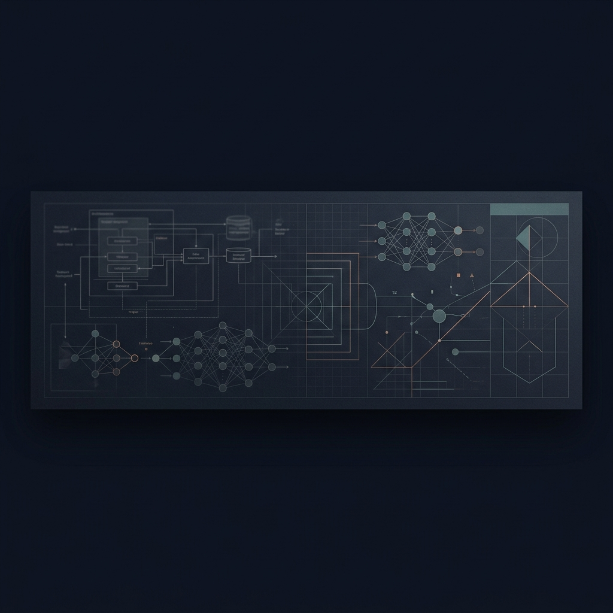

# Vardaan Bazaz

  

  <strong>Software Engineer • AI/ML • Systems Builder</strong>
   
  <small>Crafting predictable software, intelligent systems, and applied research.</small>

  <code><a href="https://vardaan-bajaj.vercel.app" style="text-decoration: none; color: #CF9E4F;">portfolio</a></code> &nbsp;•&nbsp;
  <code><a href="https://linkedin.com/in/vardaanbazaz" style="text-decoration: none; color: #CF9E4F;">linkedin</a></code> &nbsp;•&nbsp;
  <code><a href="mailto:vardaanbazaz@gmail.com" style="text-decoration: none; color: #CF9E4F;">email</a></code>

---

### ✦ Core Focus Areas

<table width="100%" style="border-collapse: collapse; border: none;">
  <tr style="border: none;">
    <td width="33%" style="border: none; padding: 10px; vertical-align: top; text-align: center;">
       
      <strong style="font-size: 0.95em;">AI / Machine Learning</strong> 
      <small style="color: #A89F84; font-size: 0.85em;">Deep learning & training pipelines</small>
    </td>
    <td width="33%" style="border: none; padding: 10px; vertical-align: top; text-align: center;">
       
      <strong style="font-size: 0.95em;">Computer Vision</strong> 
      <small style="color: #A89F84; font-size: 0.85em;">Detection & edge tracking systems</small>
    </td>
    <td width="33%" style="border: none; padding: 10px; vertical-align: top; text-align: center;">
       
      <strong style="font-size: 0.95em;">Systems Design</strong> 
      <small style="color: #A89F84; font-size: 0.85em;">Backend & distributed architectures</small>
    </td>
  </tr>
  <tr style="border: none;">
    <td width="33%" style="border: none; padding: 10px; vertical-align: top; text-align: center;">
       
      <strong style="font-size: 0.95em;">Full-Stack Development</strong> 
      <small style="color: #A89F84; font-size: 0.85em;">Responsive user-centric systems</small>
    </td>
    <td width="33%" style="border: none; padding: 10px; vertical-align: top; text-align: center;">
       
      <strong style="font-size: 0.95em;">Applied Research</strong> 
      <small style="color: #A89F84; font-size: 0.85em;">Paper-to-production adaptations</small>
    </td>
    <td width="33%" style="border: none; padding: 10px; vertical-align: top; text-align: center;">
       
      <strong style="font-size: 0.95em;">SaaS & Product</strong> 
      <small style="color: #A89F84; font-size: 0.85em;">Modular & resilient architectures</small>
    </td>
  </tr>
</table>

---

### ✦ Active Builds

*   **Crop Disease Detection API** &nbsp;`[Active Development]`
     <small style="color: #A89F84;">REST API built with FastAPI and PyTorch/YOLO to classify plant pathology, return confidence scores, and automatically render Swagger docs.</small>

---

### ✦ Publications

*   **[V-Surveillance: A Hybrid Deep Learning Framework for Real-Time Aerial Surveillance Using Drone Imagery](https://ieeexplore.ieee.org/abstract/document/11399085)** &nbsp;`[IEEE CICT 2026]`
     <small style="color: #A89F84;">Developed a hybrid deep learning framework optimized for real-time edge inference and drone action recognition.</small>
*   **[An Enhanced Object-Oriented Programming-Based Web Page Linker](https://ieeexplore.ieee.org/abstract/document/10503405)** &nbsp;`[IEEE IATMSI 2024]`
     <small style="color: #A89F84;">Designed an optimized OOP architecture to streamline and automate dynamic web page linking systems.</small>

---

### ✦ Engineering Stack

**Languages**  
   

**AI & Machine Learning**  
 

**Systems & Databases**  
   

**Frameworks & Collaborative**  
     

---

### ✦ Tasteful Telemetry

  

